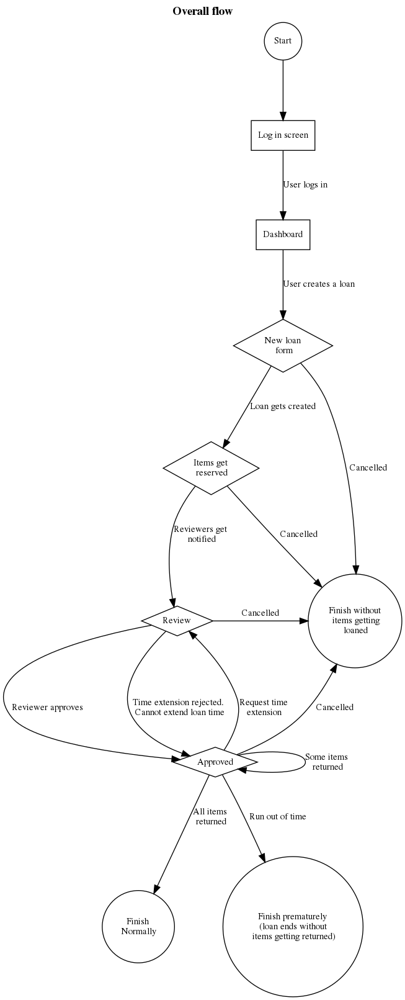

# Documentation

This folder contains ready to read documentation. The 'src' folder contains the
editable versions of these documents.

## Graphs for helping with development

### Loan life cycle

This is a graph to visualize the way loans should be handled. This contains
basic actions that can be performed at different steps in the lifetime of an
active loan.

